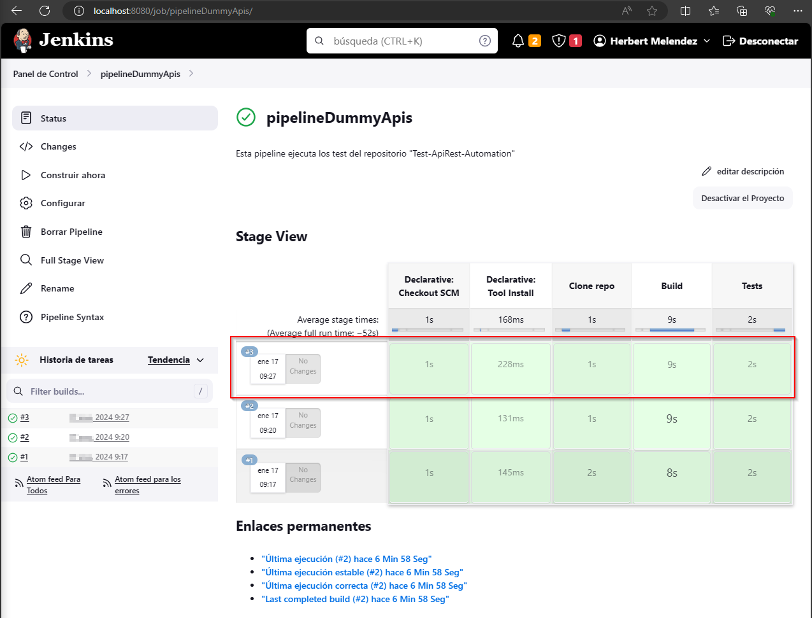
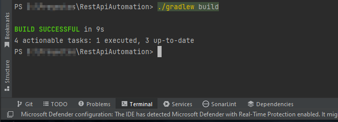
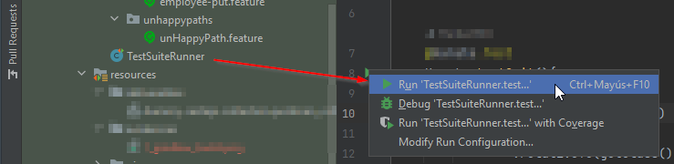
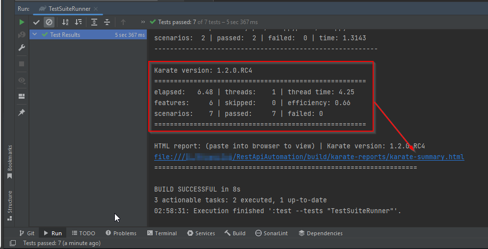
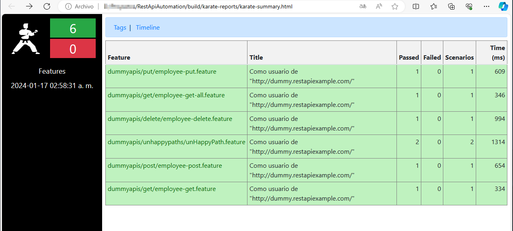
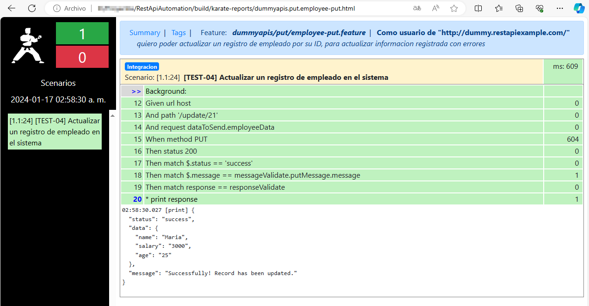

# AUTOMATIZACIÓN DE PRUEBAS A RestExample- DUMMY API - Karate Framework

Este es un proyecto de Automatización que utiliza KARATE Framework
para la creación de un script de automatización que permita probar la
API [DUMMY - RestExample](https://dummy.restapiexample.com/api/v1)

Este proyecto ha sido desarrollado por [Herbert Melendez](https://www.linkedin.com/in/herb-me-ga/) para mejorar en el
desarrollo en pruebas avanzadas de api automation.

Consultas básicas en postman en la ruta del reposotorio
> 
>  [POSTMAN](https://github.com/HerbertMG/Test-ApiRest-Automation/blob/main/src/test/resources/deliverables/dummy-restapi-collection.postman_collection.json)
>
***

## Detalles del Tester

* Name: `Herbert Melendez`
* Country: `Perú`
* City: `Lima`
* LinkedIn: [https://www.linkedin.com/in/herb-me-ga/](https://www.linkedin.com/in/herb-me-ga/)

***

##  Lenguajes & Frameworks

Este proyecto utiliza los siguientes lenguajes y frameworks:

* [KARATE](https://serenity-bdd.github.io/theserenitybook/latest/index.html) como framework de pruebas
  automatizadas.
* [Cucumber](https://cucumber.io/) como software de testing BDD que permite elaborar pruebas a partir de AC.
* [Java 11](https://www.oracle.com/java/technologies/javase/jdk11-archive-downloads.html) como lenguaje de
  programación.
* [Gradle](https://gradle.org/) como herramienta de compilación.

***

##  Pre-requisitos: 

1. Descargar la última versión estable de Java
   JDK [aquí](https://www.oracle.com/co/java/technologies/javase/jdk11-archive-downloads.html)
2. Instalar git desde [aquí](https://git-scm.com)
3. Instalar Gradle Tool desde [aquí](https://gradle.org/install/)

**🗒️ Nota**: `build.gradle` tiene toda la configuración del proyecto instalada

👀 Adicional en su **IDE** de preferencia deberá tener instalados los siguientes plugins:

1. [x] *JUnit*
2. [x] *Cucumber for Java*
3. [x] *Gherkin*
4. [x] *Lombok*

***

### 🚀 Pruebas de Integración continua

* Se utiliza pipelines en **JENKIS** para la ejecucion automatizada de pruebas:

  

---

***

### 🧪 Casos de prueba contemplados

😃 Test diseñados para validar los escenarios **Happy Paths** 
***
> **✨ FEATURE**: Como usuario de "http://dummy.restapiexample.com/"
  quiero obtener la lista completa de usuarios registrados en el sistema,
  para generar un reporte de empleados
>
> - [x] [TEST-01] Obtener la lista de empleados registrados en el sistema

> **✨ FEATURE**: Como usuario de "http://dummy.restapiexample.com/"
  quiero buscar un empleado por su ID,
  para visualizar su informacion personal
>
> - [x] [TEST-02] Obtener un empleados registrado en el sistema

> **✨ FEATURE**: Como usuario de "http://dummy.restapiexample.com/"
  quiero registrar un nuevo empleado en el sistema,
  para registrar su informacion personal como sueldo y edad
>
> - [x] [TEST-03] Crear un nuevo registro de empleado en el sistema

> **✨ FEATURE**: Como usuario de "http://dummy.restapiexample.com/"
  quiero poder actualizar un registro de empleado por su ID,
  para actualizar informacion registrada con errores
>
> - [x] [TEST-04] Actualizar un registro de empleado en el sistema

> **✨ FEATURE**: Como usuario de "http://dummy.restapiexample.com/"
  quiero poder eliminar un registro de empleado del sistema,
  para realizar un mantenimiento de la base de datos
>
> - [x] [TEST-05] Eliminar un registro de empleado en el sistema

😢 Test diseñados para validar los escenarios **UNHappy Paths**
***
> **✨ FEATURE**: Como usuario de "http://dummy.restapiexample.com/"
  quiero estar notificado si ocurrio un error,
  para validar el correcto funcionamiento de los servicios
>
> - [x] [TEST-06] Validar el metodo GET en el servicio de creacion de registro de usuario
>
> - [x] [TEST-07] Validar el metodo GET en el servicio de eliminar registro de usuario

***

## ▶️ Ejecución del proyecto:

1. Descarga el proyecto desde GitHub

* **Opción 1** (HTTPS): `https://github.com/HerbertMG/Test-ApiRest-Automation.git`
* **Opción 2:** Descárgalo como archivo Zip y extráelo

***
2. CD en la carpeta `RestApiAutomation`.
3. Configurar Gradle

* Ejecute el siguiente comando en el terminal:`./gradlew build`.

  

***

4. Ejecutar las pruebas en el proyecto

* Ir a la clase de la carpeta **TestSuiteRunner.java** `src/test/java/TestSuiteRunner.java` y ejecutar
  el Runner.

  

***

## 📄 Generación de informes

El informe al detalle con los pasos y resultados de las pruebas se registrará después de la ejecución en la ruta:
`RestApiAutomation/build/karate-reports/karate-summary.html`.

  

* En la dirección del directorio `RestApiAutomation/biuld/karate-reports/`se ejecuta el reporte `karate-summary.html`.

  

* Se ingresa en algun feature para observar el detalle.

  

Este proyecto ha sido desarrollado por [Herbert Melendez](https://www.linkedin.com/in/herb-me-ga/)
***